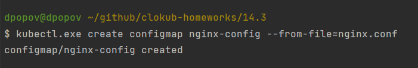
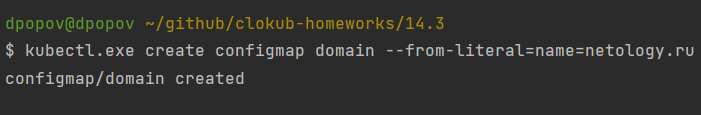
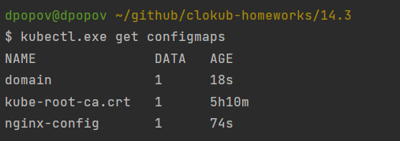
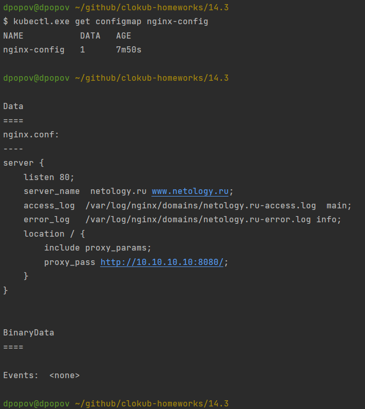
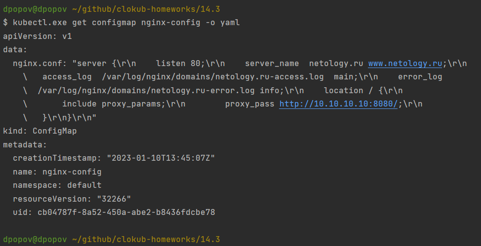
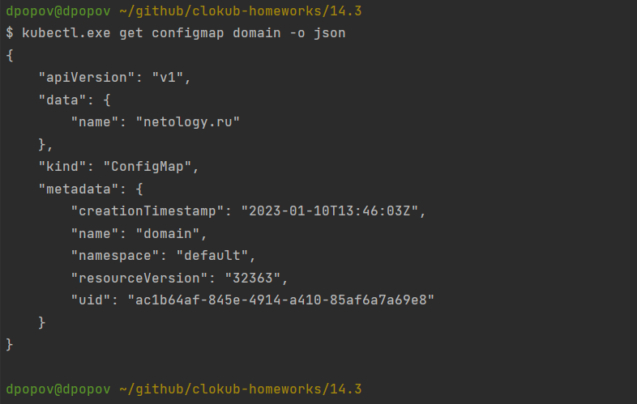
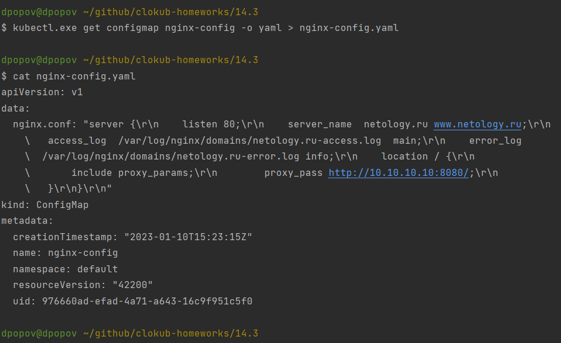
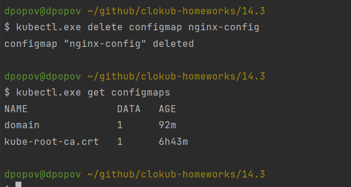
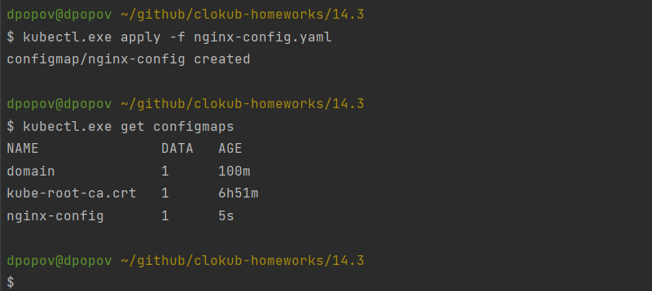

# Домашнее задание к занятию "14.3 Карты конфигураций"

## Задача 1: Работа с картами конфигураций через утилиту kubectl в установленном minikube

Выполните приведённые команды в консоли. Получите вывод команд. Сохраните
задачу 1 как справочный материал.

### Как создать карту конфигураций?

```
kubectl create configmap nginx-config --from-file=nginx.conf
kubectl create configmap domain --from-literal=name=netology.ru
```

   * Создадим _configmap_ из файла



   * Теперь созданим _configmap_ для домена



### Как просмотреть список карт конфигураций?

```
kubectl get configmaps
kubectl get configmap
```

   * Проверим список существующих _configmaps_



### Как просмотреть карту конфигурации?

```
kubectl get configmap nginx-config
kubectl describe configmap domain
```

   * Изучим _configmap_ `nginx-config`


  

### Как получить информацию в формате YAML и/или JSON?

```
kubectl get configmap nginx-config -o yaml
kubectl get configmap domain -o json
```

   * Выгрузим _configmap_ `nginx-config` в формат _yaml_



   * Теперь выгрузим _configmap_ `domain` в формат _json_




### Как выгрузить карту конфигурации и сохранить его в файл?

```
kubectl get configmaps -o json > configmaps.json
kubectl get configmap nginx-config -o yaml > nginx-config.yml
```

  * Выгрузим все _configmaps_ в один файл в формате _json_

<details>
<summary> Лог </summary>

dpopov@dpopov ~
$ kubectl.exe get configmaps -o json > configmaps.json

dpopov@dpopov ~
$ cat configmaps.json
```json
{
    "apiVersion": "v1",
    "items": [
        {
            "apiVersion": "v1",
            "data": {
                "name": "netology.ru"
            },
            "kind": "ConfigMap",
            "metadata": {
                "creationTimestamp": "2023-01-10T13:46:03Z",
                "name": "domain",
                "namespace": "default",
                "resourceVersion": "32363",
                "uid": "ac1b64af-845e-4914-a410-85af6a7a69e8"
            }
        },
        {
            "apiVersion": "v1",
            "data": {
                "ca.crt": "-----BEGIN CERTIFICATE-----\nMIIC/jCCAeagAwIBAgIBADANBgkqhkiG9w0BAQsFADAVMRMwEQYDVQQDEwprdWJl\ncm5ldGVzMB4XDTIzMDExMDA4MzUxMloXDTMzMDEwNzA4MzUxMlowFTETMBEGA1UE\nAxMKa3ViZXJuZXRlczCCASIwDQYJKoZIhvcNAQEBBQADggEPADCCAQoCggEBANmC\n/nQ47igTUqQHL2P85eCYd7dbgZnux6VJI/oj3izJ1midP1eFggKTBC5M41hEZcFu\nZhv5LJTsqu7M0vhzUlydePA4JJw50h8L8lwXsS9k03JQeTo4Hu0IyapY1eWuzPO9\nnWy9oeIPjWrUeT5udMqx4RV5KAaONN7vxS4Q2Rg8XMLr/K9VilPZYQfKGZRsqc9U\ny/b6LUMYjNK5sVhj69m7px/7dj2eNoetksc3ySfbvy9bUN7vGqgiUcq07aAl3MWJ\nXdKHx12sL21TnmmSBMkURypxhtuJEpsRtIbBQVtPI4i3LVRy6AHe486ZSgzSmUua\n2ziaBYpIZTgPsOUcvPECAwEAAaNZMFcwDgYDVR0PAQH/BAQDAgKkMA8GA1UdEwEB\n/wQFMAMBAf8wHQYDVR0OBBYEFIOEWSiaQkF/vCvPlk37iyQVzsFvMBUGA1UdEQQO\nMAyCCmt1YmVybmV0ZXMwDQYJKoZIhvcNAQELBQADggEBANSiStAonwpc/dxmO3JA\nTvSEJhGasWfO8qr4NpGkTNRJoo45qroJfRI2Lt6sf4bnGGOLG5wlhqADXvCB0ZoI\nuLt3q9Q60gI3D3/DbaqlAIkH5LDineLzX7ha0LE4y8wRr16L2Gx07d9yLsk0dgS+\nl7GZSVs9xhfjT7bPkUQb1vLPForLq7/klpP2j+um7yBxDnokvkAvi+YjZdeF2NCz\nTr/Q6N7OmDdQJ3zPLRwzeHgfKsGJAMvnqyoFbT2I6cpXBpoUm/58RTlUdvHghL0j\nlsz2JtZYYvx7Aoln4gp66SQUjNE4hXV7nIUO/O/dIYBwrhxBcxbOVYPQQzQ/sX5v\nB5Q=\n-----END CERTIFICATE-----\n"
            },
            "kind": "ConfigMap",
            "metadata": {
                "annotations": {
                    "kubernetes.io/description": "Contains a CA bundle that can be used to verify the kube-apiserver when using internal endpoints such as the internal service IP or kubernetes.default.svc. No other usage is guaranteed across distributions of Kubernetes clusters."
                },
                "creationTimestamp": "2023-01-10T08:35:39Z",
                "name": "kube-root-ca.crt",
                "namespace": "default",
                "resourceVersion": "326",
                "uid": "76d2ac81-16ef-4c14-a35b-08bfc80aa3cb"
            }
        },
        {
            "apiVersion": "v1",
            "data": {
                "nginx.conf": "server {\r\n    listen 80;\r\n    server_name  netology.ru www.netology.ru;\r\n    access_log  /var/log/nginx/domains/netology.ru-access.log  main;\r\n    error_log   /var/log/nginx/domains/netology.ru-error.log info;\r\n    location / {\r\n        include proxy_params;\r\n        proxy_pass http://10.10.10.10:8080/;\r\n    }\r\n}\r\n"
            },
            "kind": "ConfigMap",
            "metadata": {
                "creationTimestamp": "2023-01-10T13:45:07Z",
                "name": "nginx-config",
                "namespace": "default",
                "resourceVersion": "32266",
                "uid": "cb04787f-8a52-450a-abe2-b8436fdcbe78"
            }
        }
    ],
    "kind": "List",
    "metadata": {
        "resourceVersion": ""
    }
}
```
</details>

  * Теперь сохраним _configmap_ `nginx-config` в формате _yaml_



### Как удалить карту конфигурации?

```
kubectl delete configmap nginx-config
```

  * Удаляем _configmap_ `nginx-config` и убедимся, что он удален



### Как загрузить карту конфигурации из файла?

```
kubectl apply -f nginx-config.yml
```




## Задача 2 (*): Работа с картами конфигураций внутри модуля

Выбрать любимый образ контейнера, подключить карты конфигураций и проверить
их доступность как в виде переменных окружения, так и в виде примонтированного
тома


---

### Как оформить ДЗ?

Выполненное домашнее задание пришлите ссылкой на .md-файл в вашем репозитории.

В качестве решения прикрепите к ДЗ конфиг файлы для деплоя. Прикрепите скриншоты вывода команды kubectl со списком запущенных объектов каждого типа (pods, deployments, configmaps) или скриншот из самого Kubernetes, что сервисы подняты и работают, а также вывод из CLI.

---
